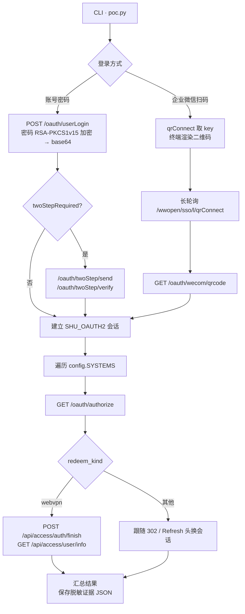

<div align="center">

# SHU SSO POC

上海大学统一身份认证（`newsso.shu.edu.cn`）OAuth 2.0 授权码流程验证工具 ——
**一次登录，向 jwxt / otp / bbs / webvpn 四个业务系统分别换取授权并验证登录**

[](https://www.python.org/)
[](https://datatracker.ietf.org/doc/html/rfc6749)
[](LICENSE)

</div>

---

## 流程解析



整体流程：**认证 → 授权取码 → 换会话 → 汇总**。
其中认证有账号密码（①）与企业微信扫码（②）两条路径，任选其一、**全程只需一次**；
授权取码（③）与换会话（④）对每个业务系统独立执行。

### ① 认证：建立 SSO 会话

| 步骤 | 端点 | 请求体 |
| :--- | :--- | :--- |
| 登录 | `POST /oauth/userLogin` | `{username, password(RSA→base64), tenantId, params(base64url)}` |
| 发码 | `POST /oauth/twoStep/send` | `{method: sms \| wecom}` |
| 校验 | `POST /oauth/twoStep/verify` | `{username, password, tenantId, params, code, method}` |

- 密码以 RSA PKCS#1 v1.5 加密后 base64 提交，公钥来自自动更新的 `config.RSA_PUBLIC_KEY_PEM`；
- `params` **必填**，缺失直接返回 `badRequestParams`；
- 响应中 `twoStepRequired` 为真才进入两步验证；
- 成功后服务端下发 `SHU_OAUTH2`（HttpOnly，host-scoped 于 `newsso.shu.edu.cn`）。

### ② 认证（备选）：企业微信扫码

不输入密码，改由企微扫码确认身份，最终同样落到 `SHU_OAUTH2` 会话。

**取二维码 `key`** —— `GET /wwopen/sso/qrConnect` 直接返回 HTML，内嵌 `qrImg?key=<hex>`：

```text
① 二维码图片 URL   https://open.work.weixin.qq.com/wwopen/sso/qrImg?key=<key>
② 二维码内容       https://open.work.weixin.qq.com/wwopen/sso/confirm2?k=<key>&notretry=yes
```

企微参数（`appid` / `agentid` / `redirect_uri`）硬编码于 `config.WECOM`，来自 newsso 前端 bundle。

**长轮询等结果** —— 页面在 `window.settings.longPollGetUrl` 暴露轮询地址，以 JSONP 形式发起：

```text
GET https://open.work.weixin.qq.com/wwopen/sso/l/qrConnect
    ?callback=jsonpCallback&key=<key>
    &redirect_uri=<urlencode(回调)>&appid=<corpid>&_=<ts>
```

```json
jsonpCallback({"status":"QRCODE_SCAN_ING","auth_code":""})
```

| status | 含义 |
| :--- | :--- |
| `QRCODE_SCAN_NEVER` | 未扫码 |
| `QRCODE_SCAN_ING` | 已扫码，等待手机确认 |
| `QRCODE_SCAN_SUCC` | 已确认，`auth_code` 有值 |
| `QRCODE_SCAN_ERR` | 二维码过期 / 失效 |

**换 SSO 会话**

```text
GET https://newsso.shu.edu.cn/oauth/wecom/qrcode
    ?code=<auth_code>&state=<paramsBase64>&appid=<corpid>
```

成功后响应 `302` 并下发 `SHU_OAUTH2` Cookie。

> **⚠️ 两个必踩的坑**
>
> - `state` 必须是 **base64url 无填充**（标准 base64 会返回 `{"message":"badRequestParams"}`）；
> - 回调**必须携带 `appid`**，缺失同样报 `badRequestParams`。

**在企微内直接打开确认页** —— `confirm2` 是网页，桌面浏览器打开只会提示「正在跳转到企业微信…」。
官方页面用内联脚本 `launchWWByScheme("wxwork://sso/jump?url=" + encodeURIComponent(url))` 完成跳转，
本 POC 输出同样格式的链接：

```text
wxwork://sso/jump?url=https%3A%2F%2Fopen.work.weixin.qq.com%2Fwwopen%2Fsso%2Fconfirm2%3Fk%3D<key>%26notretry%3Dyes
```

在浏览器地址栏、短信或聊天窗口中打开即可唤起企微并跳入内置浏览器完成确认。

<details>
<summary><b>其他已知的 <code>wxwork://</code> 协议（备查，均非本流程所需）</b></summary>

| 用途 | Scheme |
| :--- | :--- |
| 唤起企微（仅拉起 App） | `wxwork://` |
| 内置浏览器打开指定 URL | `wxwork://sso/jump?url=<urlencode(url)>` |
| webview 型模板内跳转（官方文档） | `wxwork://openurl?url=<urlencode(url)>` |
| 扫一扫 | `wxwork://platformId=wechat&wwact=qrcode` |
| 打开个人聊天窗口 | `wxwork://launch?launch_code=xxx` |

</details>

### ③ 授权：逐系统换取 code

```text
GET /oauth/authorize?response_type=code&client_id=...&redirect_uri=...&scope=...&state=...
  └─ 302 Location: <redirect_uri>?code=...&state=...
```

| key | 系统 | `client_id` | 取到 code 后如何换会话 |
| :--- | :--- | :--- | :--- |
| `jwxt` | 本科生教务系统 | `Km5t225E8KECKQ6ZDm5K2P6aS2459Cua` | 跟随 `302` |
| `otp` | OTP 令牌 | `05Q1L8woQK5350aK1U5o5GKh411ar3h1` | 跟随 `Refresh` 头跳转 |
| `bbs` | 上大 bbs（乐乎社区） | `vp8G2H42GGE86LP822LHF6Hs7f46483H` | 跟随 `302` |
| `webvpn` | WebVPN 访问控制系统 | `nn7sbb22j2tKE100T024tEp42777p755` | 私有接口两步握手（见 ④） |

**`state` 策略各不相同**，是全流程最容易踩坑的一环：

| 系统 | 策略 |
| :--- | :--- |
| `jwxt` | 授权请求本就不带 `state`，由 POC 生成随机 UUID |
| `otp` | 需先访问 `https://otp.shu.edu.cn/` 预取 `state`（存于 `ASP.NET_SessionId`），否则回调报「State验证失败」 |
| `bbs` | 需先访问 `https://bbs.shu.edu.cn/auth/oauth2_basic` 向其索要 `state` |
| `webvpn` | `state` 为固定结构化值 `base64({"externalId": <认证方式ID>})`，非随机 |

**Base64 有两种形态，不可混用**：

| 用途 | 编码 | 特点 |
| :--- | :--- | :--- |
| `params` 参数（`utils.b64_params`） | base64**url** | `-_` 字符集，**去除 `=` 填充** |
| WebVPN 的 `state` | 标准 base64 | `+/` 字符集，**保留 `=` 填充**（`btoa` 行为） |

新增业务系统只需在 `src/config.py` 的 `SYSTEMS` 中追加一项，核心流程无需改动 ——
各系统通过 `redeem_kind` / `state_kind` / `detection` 等字段声明自身差异。

### ④ 换会话：`code` → 系统会话

**通用路径**：跟随 `Location` 头跳转即完成（`otp` 例外，使用 `Refresh` 响应头而非标准 `302`）。

**WebVPN 例外**：目标站是纯前端 SPA，nginx 对**所有**路径都返回同一份 `index.html`，
因此不能靠跳转换会话，需调两个私有接口完成握手：

```text
① POST /api/access/auth/start
   {"externalId":"YJrvSXWl",
    "data":"{\"callbackUrl\":\"https://webvpn.shu.edu.cn/callback/oauth2\",
             \"state\":\"eyJleHRlcm5hbElkIjoiWUpydlNYV2wifQ==\"}"}
   ← {"code":0,"data":{"action":{"login_url":".../oauth/authorize?access_type=offline&..."}}}

② 浏览器跳转 login_url → newsso 302 回
   https://webvpn.shu.edu.cn/callback/oauth2?code=...&state=...

③ POST /api/access/auth/finish
   {"externalId":"YJrvSXWl",
    "data":"{\"callbackUrl\":\"...\",\"code\":\"<授权码>\",
             \"deviceId\":\"<32位hex>\",\"state\":\"...\"}"}
   ← {"code":0} 表示会话已建立（服务端持 code 向 newsso 换取 token）

④ GET /api/access/user/info
   ← {"code":0,"data":{"userId":...,"username":...}}   ← 判定登录成功的依据
```

客户端信息（从首页跳转的 `/oauth2/login/<paramsBase64>` 解出，经抓包核对）：

| 项 | 值 |
| :--- | :--- |
| `client_id` | `nn7sbb22j2tKE100T024tEp42777p755` |
| `redirect_uri` | `https://webvpn.shu.edu.cn/callback/oauth2` |
| `scope` | 空 |
| 额外授权参数 | `access_type=offline` |

实测约束：

- **`externalId` 是固定值而非随机值** —— 它是「认证方式」在服务端的 ID，由
  `GET /api/access/authentication/list?type=0` 下发（取 `authType == 5`，即 `Oauth2Type`）。
  实测值 `YJrvSXWl`，抓取失败时回退到 `config.WEBVPN["external_id_fallback"]`。
- **`deviceId` 必填** —— 缺失时 `auth/finish` 返回 `{"code":20001,"message":"DeviceId未找到"}`；
  提供任意非空值后即推进到 `20000 认证失败`（说明请求结构已正确）。
  前端取 FingerprintJS 的 `visitorId`（持久化于浏览器，故同一浏览器恒定）。
  POC 无浏览器指纹，使用 `md5("shu-sso-poc::" + 账号名)` 生成**稳定**伪指纹
  （`utils.device_id_for`），避免每次运行被服务端视为新设备。
- **WebVPN 会反代 newsso** —— `auth/start` 返回的 `login_url` 指向
  `https-newsso-shu-edu-cn-443.webvpn.shu.edu.cn`，规则为
  `<scheme>-<主机名中的 . 替换为 ->-<端口>.webvpn.shu.edu.cn`。
  而 POC 的 `SHU_OAUTH2` 由直连 `newsso.shu.edu.cn` 建立，**只有直连才能复用**，
  故 `client.unproxy_url()` 将反代主机还原为真实主机 —— 且**仅当还原结果以 `.shu.edu.cn`
  结尾时才改写**，避免携带 Cookie 的请求被送往意外主机。
- **该站无法用 URL / 正文关键词判定成功** —— `/callback/oauth2`、`/site-nav/`、`/auth/login`
  返回的字节完全相同，且页面模板本身含 `WebVPN` 字样，用作判定只会产生假阳性，
  因此本系统以 `detection: "api"` 标记，**只认接口返回码**。
- **登录后可能有附加动作** —— `user/info` 会带 `needTriggerTFA` / `needChangePwd` /
  `needToBindLocalAccount`，POC 将其列入结果的 `pending_actions` 字段。

> 逆向材料：`_analysis_bundle/webvpn/`（已被 `.gitignore` 忽略），
> `auth-DY9U0HS6.js` 为接口封装，`Oauth2Callback-CV3Kw-qa.js` 为回调处理逻辑。

### 关键结论

1. **授权码一次性、绑定 `state`，不可复用**；
2. **SSO 会话 Cookie 可复用** —— `SHU_OAUTH2` host-scoped 于 `newsso.shu.edu.cn`，
   只要后续授权请求仍发往 newsso，即可免登录直接取得新的授权码；
3. 各业务系统仅负责「用 `code` 换自己的会话」，彼此独立、互不影响。

```text
                          ┌──────────────────────────────┐
    一次登录  ───────────▶ │  newsso.shu.edu.cn           │
                          │  SHU_OAUTH2（host-scoped）    │
                          └───────────────┬──────────────┘
                                          │ 复用同一会话
        ┌─────────────┬───────────────────┼───────────────┬─────────────┐
        ▼             ▼                   ▼               ▼             ▼
      jwxt          otp                 bbs            webvpn      （可扩展）
```

## 快速开始

### 环境要求

| 项 | 要求 |
| :--- | :--- |
| Python | 3.10 或更高（实测 3.12） |
| 依赖 | `requests`、`cryptography`；`qrcode` 可选（终端二维码） |
| 网络 | 可访问 `newsso.shu.edu.cn` 及目标业务系统 |

### 安装

```bash
git clone <repo-url> && cd shu-sso-poc

# Windows
python -m venv .venv && .venv\Scripts\activate
# macOS / Linux
python -m venv .venv && source .venv/bin/activate

pip install requests cryptography qrcode
```

> 未安装 `qrcode` 亦不影响运行，仅终端二维码渲染会降级为输出图片 URL。

## 使用

```bash
python poc.py                          # 交互式选择登录方式（推荐）
python poc.py --login password         # 账号密码登录
python poc.py --login wecom_scan       # 企业微信扫码登录
python poc.py --method sms             # 账号密码登录时指定 2FA 方式
python poc.py --scan-timeout 300       # 扫码等待秒数（默认 180）
python poc.py --no-qr                  # 不在终端渲染二维码
python poc.py --qr-style ascii         # 二维码改用无颜色整块样式
```

### 登录模式

| 选项 | 模式 | 说明 |
| :---: | :--- | :--- |
| `[1]` | `password` | 学号/工号 + 密码 + 两步验证（企业微信 / 短信），登录后自动跑通全部业务系统 |
| `[2]` | `wecom_scan` | 企业微信扫码，扫码确认后自动建立会话并登录全部业务系统 |

- **账号密码模式**：输入学号 → 输入密码（`getpass`，不回显）→ 选择 2FA → 输入验证码 → 自动登录全部系统
- **企微扫码模式**：终端直接画出二维码 → 企业微信扫码确认 → 长轮询取得 `auth_code`
  → 换取 `SHU_OAUTH2` 会话 → 自动登录全部系统

### 命令行参数

| 参数 | 默认值 | 说明 |
| :--- | :--- | :--- |
| `--tenant` | `上海大学` | 院校标识（`tenantId`） |
| `--login {password,wecom_scan}` | 交互选择 | 登录方式 |
| `--method {wecom,sms}` | 交互选择 | 账号密码模式下的 2FA 方式 |
| `--scan-timeout` | `180` | 企微扫码等待秒数 |
| `--no-qr` | 关闭 | 不在终端渲染二维码 |
| `--qr-style {block,ascii}` | `block` | 二维码渲染样式 |

### 输出示例

```text
──────────────────────────────────────────────────────────────
▀▀▀▀▀▀▀▀▀▀▀▀▀▀▀▀▀▀▀▀▀▀▀▀▀▀▀▀▀▀▀▀▀▀▀▀▀▀▀▀▀          ← 直接可扫的二维码
▀▀▀▀▀▀▀▀▀▀▀▀▀▀▀▀▀▀▀▀▀▀▀▀▀▀▀▀▀▀▀▀▀▀▀▀▀▀▀▀▀             （终端里是白底黑块）
 请用企业微信扫描下方二维码，并在手机上点「确认登录」
──────────────────────────────────────────────────────────────
① 二维码图片 URL            https://open.work.weixin.qq.com/wwopen/sso/qrImg?key=<key>
② 二维码内容（确认页）      https://open.work.weixin.qq.com/wwopen/sso/confirm2?k=<key>&notretry=yes
③ 包装后的 URI 跳转         wxwork://sso/jump?url=<urlencode(②)>

等待扫码确认（最多 180 秒，Ctrl+C 可中断）...
     等待扫码
     已扫码，请在手机上确认
     已确认，正在换取会话
  ✓ 已取得 auth_code，换取 SSO 会话 ...
  ✓ SSO 会话已建立（Cookie: SHU_OAUTH2）
```

## 终端二维码渲染

企微二维码的**内容就是扫码后打开的确认页地址**（`confirm_url`）——
已用 `pyzbar` 解码官方 `qrImg?key=<key>` 返回的 PNG 并逐字核对。
因此可以在本地用 `qrcode` 重新生成同样内容的二维码，扫码后打开的是同一个确认页，
无需再打开浏览器点击图片链接。

### 渲染方案

`utils.render_qr_terminal()` 采用**半块字符压缩**：

1. `▀`（U+2580）以**前景色绘制字符格上半、背景色绘制下半**，一个字符格承载上下两个模块；
   终端字符高宽比约为 2:1，压缩后行列比例恰好接近二维码的方块比例；
2. 前景/背景均显式指定纯黑/纯白 —— 无论终端是深色还是浅色主题，二维码始终为「白底黑块」，
   不受主题影响；
3. 仅在颜色发生变化时输出 ANSI 控制码，减小输出体积。

### 样式选择

| 样式 | 字符 | 宽度 | 适用场景 |
| :--- | :--- | :--- | :--- |
| `block`（默认） | `▀` + ANSI 颜色 | 41 列 | 紧凑，需终端支持颜色 |
| `ascii` | `██` / 空格 | 82 列 | 不依赖颜色，兼容性最佳 |

### 降级与开关

| 条件 | 行为 |
| :--- | :--- |
| 未安装 `qrcode` | 回退打印图片 URL，并提示 `pip install qrcode` |
| 输出被重定向（非 TTY） | 跳过渲染，避免 ANSI 控制码污染文件 |
| 终端过窄 | 提示当前列数并建议拉宽窗口，仍会渲染 |
| `--no-qr` | 强制关闭终端二维码 |

> **验证方法**：将渲染出的 ANSI 文本反向解析回模块矩阵，与原始矩阵逐格比对一致；
> 再栅格化后交由 `pyzbar` 解码，可完整还原 `confirm_url`，确认确实可扫。

## 工程说明

### 项目结构

```text
poc.py          CLI 入口（参数解析、模式选择、分发）
src/
  config.py     协议常量（端点、RSA 公钥、企微参数、目标系统）
  utils.py      工具函数（RSA 加密、base64url、脱敏、日志、终端二维码）
  client.py     ShuSSO HTTP 客户端（newsso + 各业务系统）
  flows.py      高层登录流程（密码 / 企微扫码、批量登录、汇总）
```

核心逻辑全部位于 `src/`，`poc.py` 仅负责命令行入口。

### 模块 API

| 模块 | 主要符号 | 说明 |
| :--- | :--- | :--- |
| `config` | `SSO_BASE` `WECOM` `WEBVPN` `SYSTEMS` `CAPTURE_DIR` | 协议常量与目标系统注册表 |
| `config` | `fetch_rsa_public_key_pem()` | 从线上 bundle 抓取最新 RSA 公钥 |
| `utils` | `rsa_encrypt_password()` `b64_params()` | 密码加密与参数编码 |
| `utils` | `device_id_for()` `mask()` `redact()` `save_json()` | 伪指纹、脱敏与证据落盘 |
| `utils` | `render_qr_terminal()` | 终端二维码渲染 |
| `client` | `ShuSSO.login` / `send_2fa_code` / `verify_2fa_code` | 认证与两步验证 |
| `client` | `ShuSSO.authorize` / `redeem` / `bootstrap_state` | 通用授权与换会话 |
| `client` | `ShuSSO.wecom_qrcode_info` / `wecom_wait_scan` / `wecom_redeem` | 企微扫码链路 |
| `client` | `ShuSSO.webvpn_*` / `redeem_webvpn` | WebVPN 私有握手 |
| `client` | `unproxy_url()` | WebVPN 反代主机名还原 |
| `flows` | `password_flow()` / `wecom_scan_flow()` | 两种登录入口 |
| `flows` | `login_all_systems()` / `print_summary()` | 批量登录与结果汇总 |

### RSA 公钥自动更新

登录密码使用 newsso 前端 bundle 中的 RSA 公钥（`config.RSA_PUBLIC_KEY_PEM`）加密。
该公钥位于登录 chunk `/p__oauth2__login__index.<hash>.async.js` 内
（经 `setPublicKey(Pe)` 传给 JSEncrypt）。每次前端重新打包 hash 都会变化，公钥亦可能随部署更新，
因此 `config` 在**模块导入时自动抓取最新值**：

| 优先级 | 来源 | 说明 |
| :---: | :--- | :--- |
| 1 | **线上抓取** | `GET /oauth2/login/` → 解析 `preload_helper \| umi` 清单 → 定位登录 chunk → 正则提取 PEM |
| 2 | **本地缓存** | 抓取成功后写入 `.rsa_public_key.pem`，后续导入直接复用，不再联网 |
| 3 | **内置回退** | 联网失败时使用 `RSA_PUBLIC_KEY_PEM_FALLBACK` |

也可手动调用：

```python
from src.config import fetch_rsa_public_key_pem
pem = fetch_rsa_public_key_pem()   # 成功返回最新 PEM，失败返回 None
```

### 退出码

| 码 | 含义 |
| :---: | :--- |
| `0` | 全部目标系统登录成功 |
| `1` | 学号或密码为空 |
| `2` | 登录失败（`/oauth/userLogin` 未返回 `success`） |
| `3` | 2FA 发码失败，或验证码为空 |
| `4` | 2FA 校验失败 |
| `5` | 部分业务系统登录失败 |
| `6` | 未能解析出企微二维码 `key` |
| `7` | 扫码超时或失败（未取得 `auth_code`） |
| `8` | 用 `auth_code` 换取 SSO 会话失败 |
| `130` | 用户中断（`Ctrl+C`） |

### 运行产物

脱敏后的证据 JSON 写入 `captures/`（已被 `.gitignore` 忽略）：

| 文件 | 产生时机 |
| :--- | :--- |
| `script-result.json` | 账号密码模式正常完成 |
| `script-wecom-scan.json` | 企微扫码模式正常完成 |
| `script-00-wecom-scan-failed.json` | 二维码 `key` 解析失败 / 扫码超时 |
| `script-00-wecom-redeem-failed.json` | 企微换会话失败 |
| `script-01-login-failed.json` | 登录失败 |
| `script-02-send-code-failed.json` | 2FA 发码失败 |
| `script-03-verify-failed.json` | 2FA 校验失败 |

## 常见问题

<details>
<summary><b>提示 <code>badRequestParams</code>？</b></summary>

三种常见原因：

1. `/oauth/userLogin` 缺少 `params` 字段（必填）；
2. 企微回调的 `state` 使用了标准 base64，而非 base64url 无填充；
3. 企微回调缺少 `appid` 参数。

</details>

<details>
<summary><b>OTP 回调提示「State验证失败」？</b></summary>

`otp.shu.edu.cn` 会校验存于 `ASP.NET_SessionId` 中的 `state`。
必须先访问其入口页预取 `state`（见 `SYSTEMS["otp"]["needs_state_bootstrap"]`）后再发起授权。

</details>

<details>
<summary><b>WebVPN 返回 <code>20001 DeviceId未找到</code>？</b></summary>

`auth/finish` 的 `deviceId` 为必填项。POC 默认由 `utils.device_id_for(账号名)` 生成稳定伪指纹，
请检查传入的 `device_id` / 账号名是否为空。

</details>

<details>
<summary><b>终端二维码显示不出来或扫不出？</b></summary>

- 确认已安装 `qrcode`：`pip install qrcode`；
- 终端不支持 ANSI 颜色时，改用 `--qr-style ascii`；
- 终端过窄会提示列数不足，请拉宽窗口后重跑；
- 输出被重定向到文件时不会渲染（避免 ANSI 控制码污染），可改用输出的图片 URL。

</details>

<details>
<summary><b>系统实际登录成功，却被判定为失败？</b></summary>

除 `webvpn` 外，其余系统通过 URL / 正文关键词判定成功。
若上游页面改版，请同步更新 `SYSTEMS` 中对应系统的
`success_url_contains` / `success_body_contains`。

</details>

<details>
<summary><b>证书校验为什么是关闭的？</b></summary>

`requests.Session.verify = False` 为按需求显式关闭，同时抑制了 urllib3 的告警噪音。
请仅在受控网络环境下使用；如需严格校验，可自行改为 `True` 并提供 CA 证书。

</details>

## 许可证

[AGPL-3.0](LICENSE)
